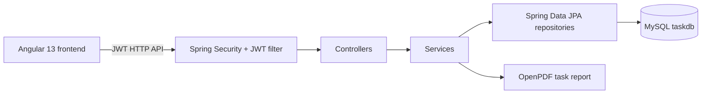
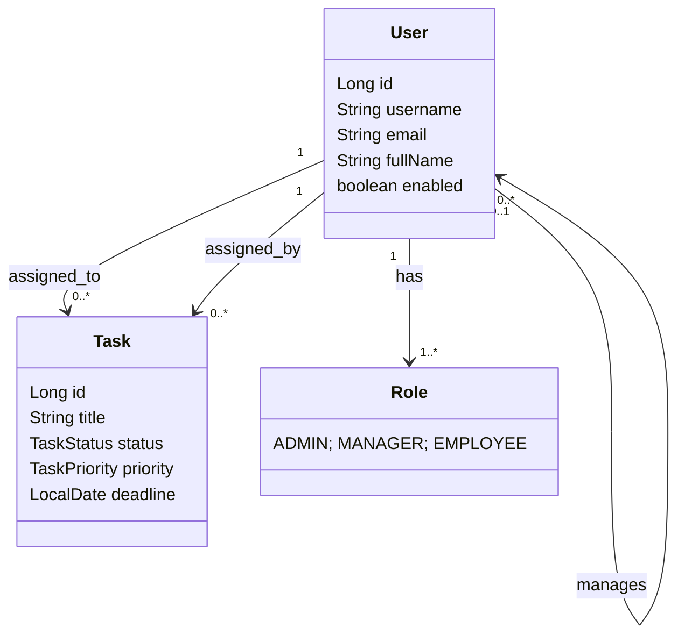
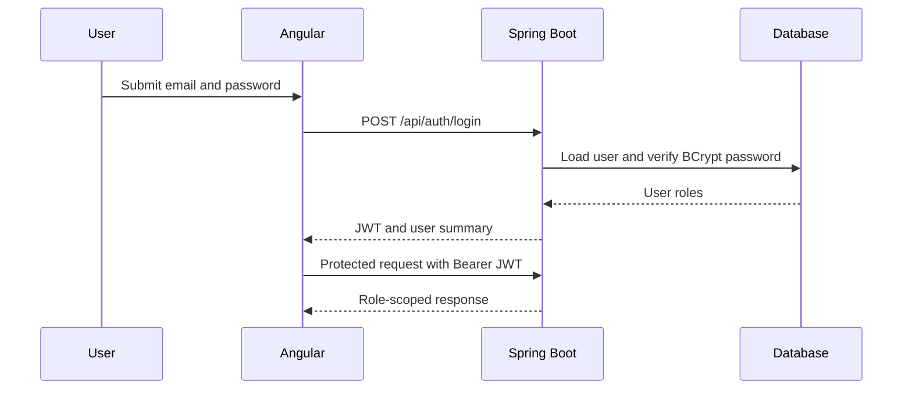

# FIFO Tech UML Diagrams

## Backend component diagram

```mermaid
flowchart LR
  Angular[Angular 13 frontend] -->|JWT HTTP API| Security[Spring Security + JWT filter]
  Security --> Controllers[Controllers]
  Controllers --> Services[Services]
  Services --> Repositories[Spring Data JPA repositories]
  Repositories --> MySQL[(MySQL taskdb)]
  Services --> PDF[OpenPDF task report]
```

## Core domain diagram

```mermaid
classDiagram
  class User {
    Long id
    String username
    String email
    String fullName
    boolean enabled
  }
  class Task {
    Long id
    String title
    TaskStatus status
    TaskPriority priority
    LocalDate deadline
  }
  class Role { ADMIN; MANAGER; EMPLOYEE }
  User "0..1" --> "0..*" User : manages
  User "1" --> "0..*" Task : assigned_to
  User "1" --> "0..*" Task : assigned_by
  User "1" --> "1..*" Role : has
```

## Authentication sequence

```mermaid
sequenceDiagram
  participant U as User
  participant A as Angular
  participant B as Spring Boot
  participant D as Database
  U->>A: Submit email and password
  A->>B: POST /api/auth/login
  B->>D: Load user and verify BCrypt password
  D-->>B: User roles
  B-->>A: JWT and user summary
  A->>B: Protected request with Bearer JWT
  B-->>A: Role-scoped response
```
